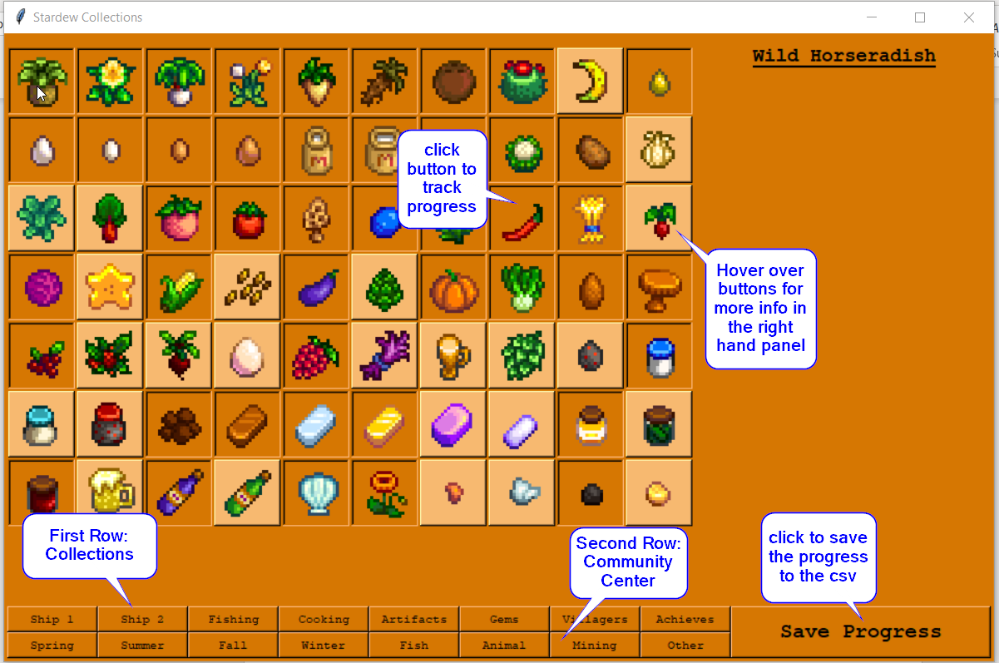

# StardewCollections1.0
Ever get annoyed at constantly opening the menu while trying to finish the Stardew Valley Collections? Keep this program open on a second monitor and keep track of your progress.  When you are done for the day, hit the save button to save your progress to the csv.  

## Implementation
I'm still new to python, haven't learned how to create a full executable yet, but if you copy these files into an existing pycharm environment, it should run properly for you. will update when I get the executable going.

## How it works

